# OFDM vs OTFS: BER Performance in Doubly-Selective Wireless Channels

## 1. Project Overview

This undergraduate project compares **OFDM (Orthogonal Frequency Division Multiplexing)** and **OTFS (Orthogonal Time Frequency Space)** in a wireless channel that changes with both delay and Doppler.

The main objective is:

> **To compare the BER performance of OFDM and OTFS under the same channel and receiver conditions, and to see how their performance changes as Doppler increases.**

The project implements the complete communication chain in MATLAB:

1. Generate QAM data.
2. Create the OFDM or OTFS waveform.
3. Pass the waveform through a multipath, time-varying EVA channel.
4. Add noise and selected practical impairments.
5. Perform channel estimation, equalization, and detection.
6. Measure BER, NMSE, ICI, receiver cost, and other performance measures.
7. Generate the final plots and save the numerical results.

The main result is the OFDM-versus-OTFS BER comparison.

---

## 2. Project Goal

### Main goal

The main experiment compares OFDM and OTFS while changing normalized Doppler:

**Normalized Doppler = fD × Tu**

where:

**Tu = 1 / Δf**

and Δf is the OFDM subcarrier spacing.

For the project:

- Δf = 15 kHz
- Tu = 66.666667 µs

The tested normalized-Doppler values are:

| Normalized Doppler | Doppler frequency |
|---:|---:|
| 0.01 | 150 Hz |
| 0.05 | 750 Hz |
| 0.10 | 1500 Hz |
| 0.20 | 3000 Hz |

### Supporting goals

The project also studies:

- channel estimation;
- inter-carrier interference (ICI);
- receiver performance;
- receiver computational cost;
- OTFS pilot detection;
- practical impairments;
- Doppler/channel behavior;
- covariance mismatch;
- MIMO reception and CSI aging.

These experiments help explain the main BER comparison.

---

## 3. What We Achieved

The project achieved the original goal and produced a complete working simulation.

### Main achievement

Under the tested EVA doubly-selective channel, OTFS shows a clear BER advantage over OFDM when both are evaluated using the same basic conditions.

At BER = 10<sup>-2</sup>, the measured/interpolated OTFS advantage is:

| fD × Tu | OFDM Eb/N0 | OTFS Eb/N0 | OTFS advantage |
|---:|---:|---:|---:|
| 0.01 | 15.15 dB | 10.02 dB | **5.13 dB** |
| 0.05 | 13.62 dB | 9.02 dB | **4.60 dB** |
| 0.10 | 13.68 dB | 8.94 dB | **4.75 dB** |
| 0.20 | 13.46 dB | 9.09 dB | **4.37 dB** |

Therefore, the main project result is:

> **In the tested EVA channel and matched-receiver setup, OTFS required approximately 4.4–5.1 dB less Eb/N0 than OFDM to reach BER = 10<sup>-2</sup> over fD × Tu = 0.01–0.20.**

The project also completed all 16 simulation studies and the final run passed 46/46 numerical checks.

---

# Contents

| Section | What it contains |
|---|---|
| 1 | Project overview |
| 2 | Project goal |
| 3 | What was achieved |
| 4 | Main OFDM vs OTFS result |
| 5 | Other results |
| 6 | Simulation setup |
| 7 | Simulation flow |
| 8 | Folder structure |
| 9 | Validation |
| 10 | Running the project |
| 11 | Output files |
| 12 | Final conclusion |

---

# 4. Main OFDM vs OTFS Result

## 4.1 Fair comparison

The main comparison uses:

- the same EVA physical channel;
- the same information bits;
- 4096 information symbols per frame;
- 4608 transmitted samples per frame;
- the same Eb/N0 accounting;
- the same truncated PCG-MMSE receiver class;
- the same receiver iteration and stopping settings.

This prevents a receiver difference from being mistaken for a waveform difference.

## 4.2 Figure 8 — BER comparison

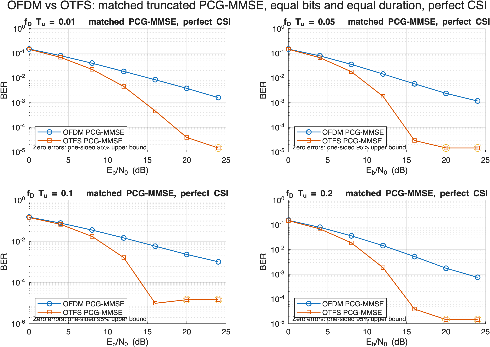

The curves show a clear separation between OFDM and OTFS over the tested Doppler range.

At 12 dB, the measured BER values are:

| fD × Tu | OFDM BER | OTFS BER | Approx. improvement |
|---:|---:|---:|---:|
| 0.01 | 1.850 × 10<sup>-2</sup> | 4.565 × 10<sup>-3</sup> | **4.1× lower** |
| 0.05 | 1.449 × 10<sup>-2</sup> | 1.816 × 10<sup>-3</sup> | **8.0× lower** |
| 0.10 | 1.477 × 10<sup>-2</sup> | 1.641 × 10<sup>-3</sup> | **9.0× lower** |
| 0.20 | 1.454 × 10<sup>-2</sup> | 1.865 × 10<sup>-3</sup> | **7.8× lower** |

At fD × Tu = 0.10 and Eb/N0 = 20 dB:

- OFDM: 475 errors out of 204800 bits
- OFDM BER: 2.3193 × 10<sup>-3</sup>
- OTFS: 0 observed errors in the tested bits

A zero-error result is not treated as an exactly zero BER. It means that no errors were observed in the simulated bits. The corresponding finite-sample 95% upper bound used in the project is approximately 1.4628 × 10<sup>-5</sup>.

The important observation is the large performance gap between the two waveforms.

---

# 5. Other Results

## 5.1 Figure 1 — Baseline BER

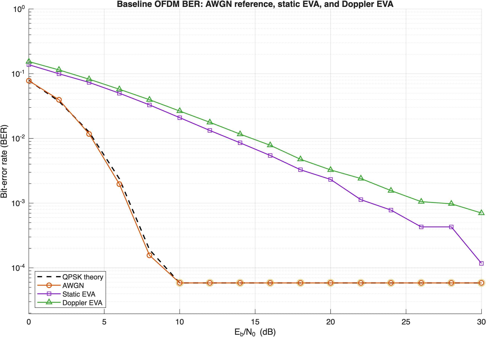

The AWGN curve provides the ideal reference. The static and Doppler EVA cases show additional degradation because of multipath and, for the Doppler case, time variation.

---

## 5.2 Figure 2 — Channel Estimation

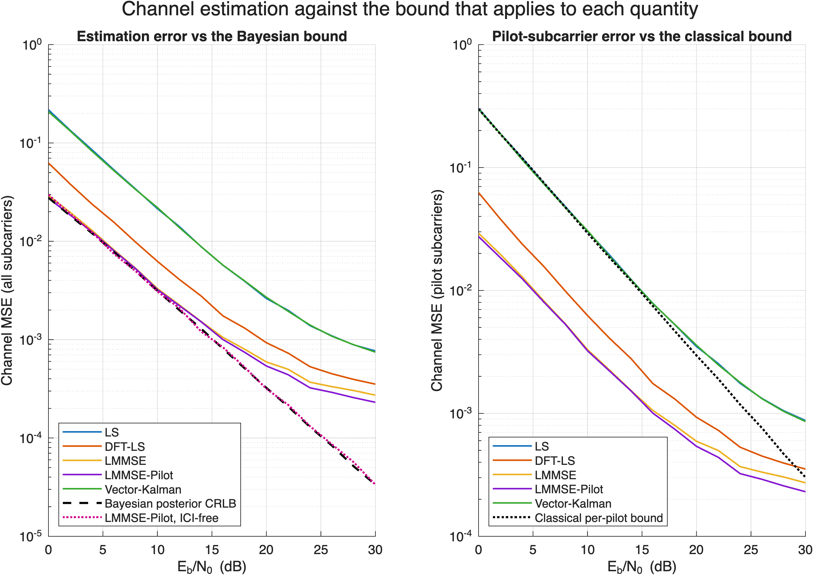

The tested methods are:

- LS
- DFT-LS
- LMMSE
- Vector-Kalman

The observed ordering is:

**Vector-Kalman ≲ LMMSE < DFT-LS < LS**

Around 20 dB, vector-Kalman gives roughly a fivefold NMSE reduction compared with LS in the tested setup.

---

## 5.3 Figure 3 — ICI Growth

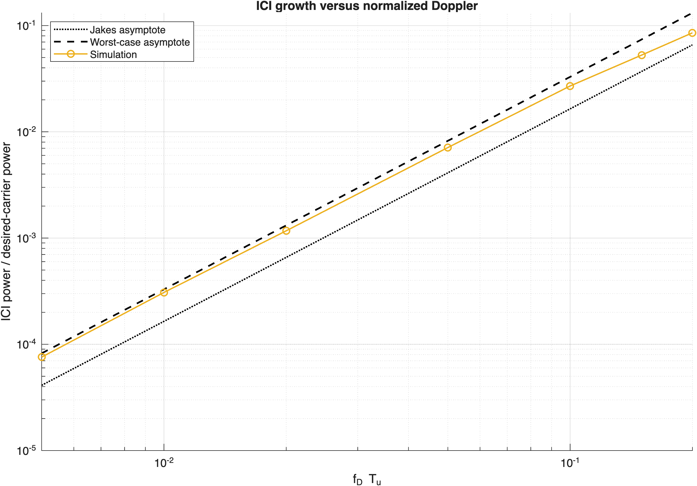

ICI increases strongly with Doppler.

For small normalized Doppler, the simulated behavior is broadly consistent with the expected approximately quadratic trend.

This shows why a time-varying channel makes OFDM detection more difficult.

---

## 5.4 Figure 4 — BEM Order

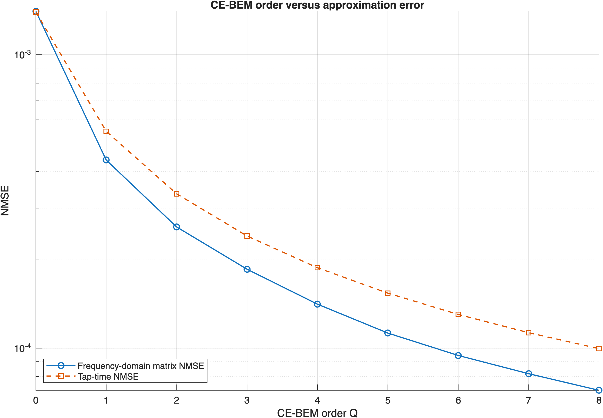

This experiment studies the Basis Expansion Model order needed to represent the channel variation.

The purpose is to understand the trade-off between model accuracy and computation.

---

## 5.5 Figure 5 — Receiver Comparison

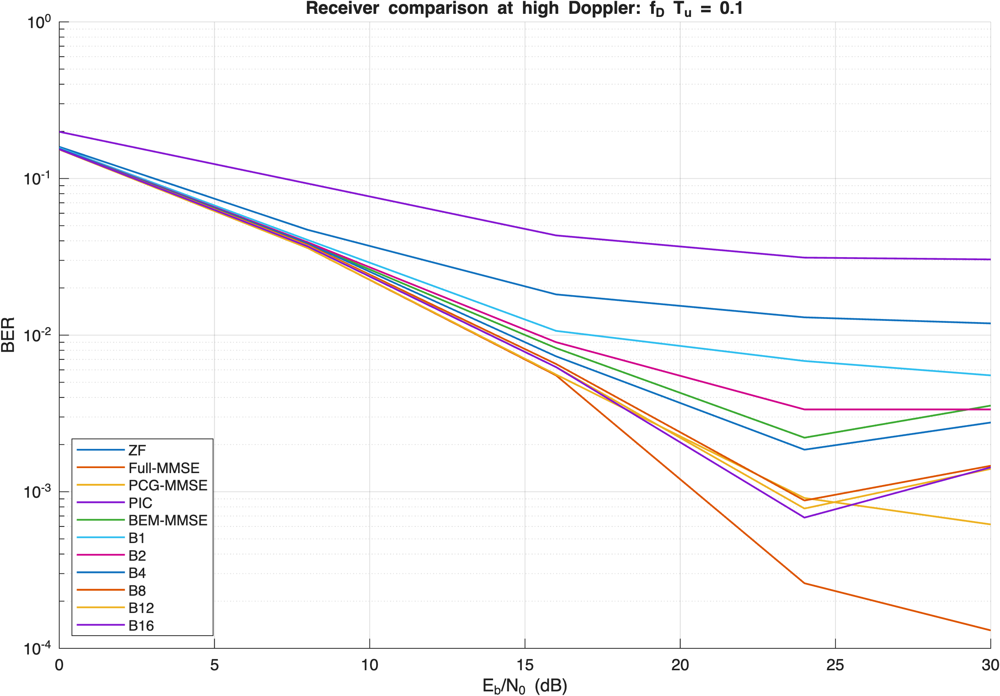

This experiment compares receiver choices at higher Doppler.

It shows the trade-off between BER performance and receiver processing requirements.

---

## 5.6 Figure 6 — Receiver Cost

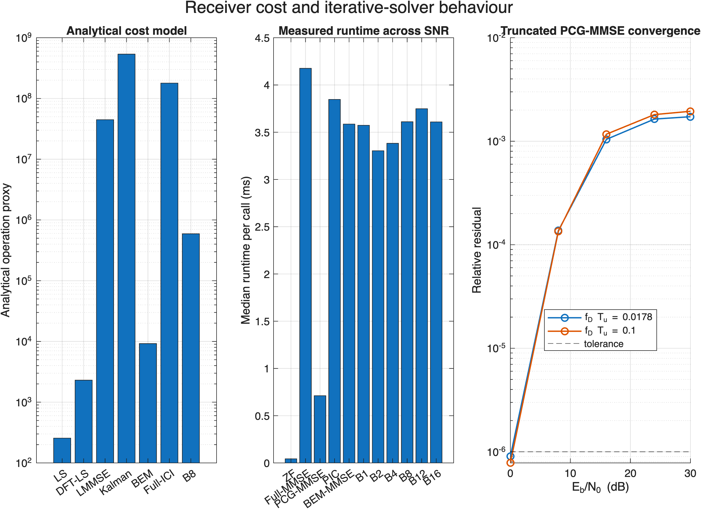

The project also measures the computational cost of the receivers.

This allows performance to be considered together with implementation cost.

---

## 5.7 Figure 7 — OTFS Detectors

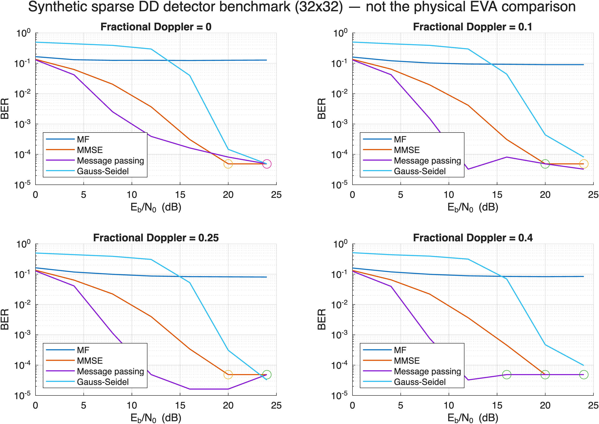

Different OTFS detection methods are compared.

The message-passing detector is treated as a separate OTFS detector experiment. The main OFDM-vs-OTFS result does not depend on giving OTFS a different detector.

---

## 5.8 Figure 9 — OTFS Pilot

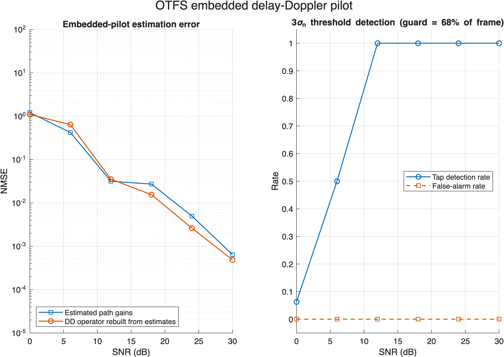

This experiment evaluates the OTFS pilot-based delay/Doppler path detection method used in the project.

It shows the behavior of the selected pilot, guard region, threshold, and channel conditions.

---

## 5.9 Figure 10 — Practical Impairments

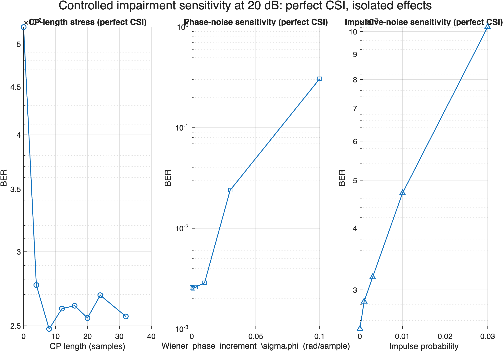

The impairment experiments cover:

- cyclic-prefix stress;
- phase noise;
- impulsive noise.

The wide EVA representation has a channel-memory span of 13 samples, while the nominal OFDM CP is 32 samples.

The phase-noise experiment shows increasing BER as phase noise becomes stronger.

The impulsive-noise experiment also shows increasing BER as the impulse probability increases.

---

## 5.10 Figure 11 — Physical Channel

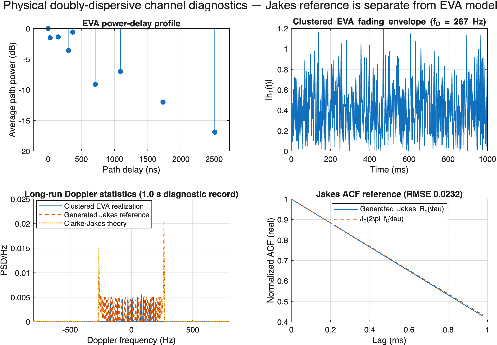

The project keeps the clustered EVA channel separate from an ideal Clarke/Jakes reference.

The generated Jakes reference follows the expected autocorrelation:

**R(τ) = J0(2π fD τ)**

The final normalized ACF RMSE is approximately **0.0232**.

This checks the Jakes reference generation. The clustered EVA channel is a separate physical model.

---

## 5.11 Figure 12 — Covariance Mismatch

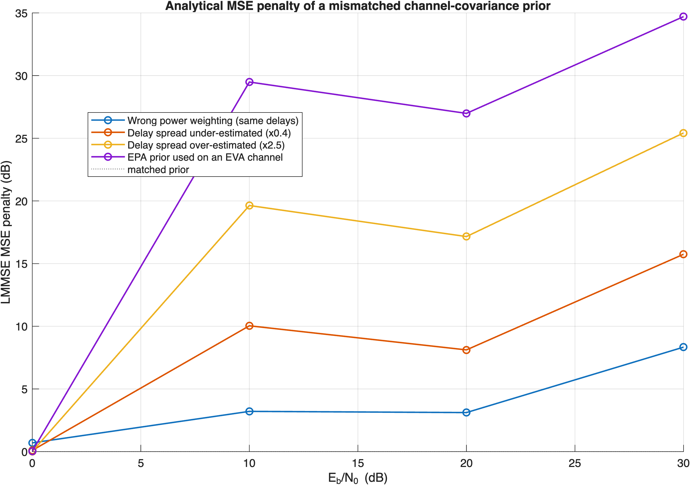

This experiment studies the effect of using an incorrect channel covariance model in an LMMSE/Bayesian estimator.

The result shows that estimator performance depends on how well the assumed channel statistics match the actual channel.

---

## 5.12 Figure 13 — MIMO

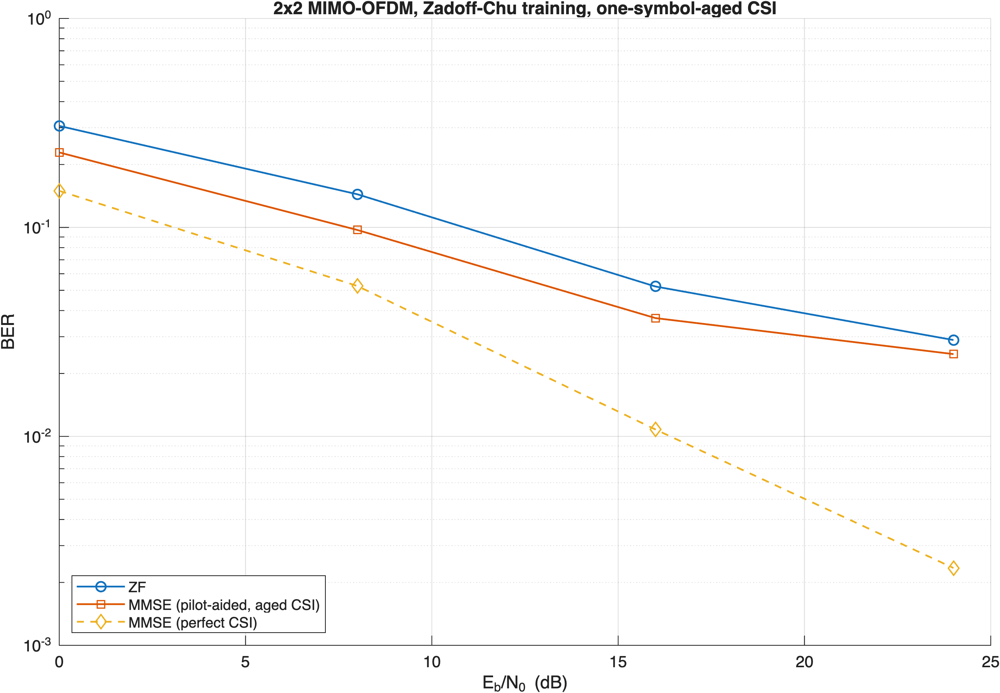

The tested ordering is:

**Perfect-CSI MMSE < Aged-CSI MMSE < ZF**

The result shows that channel-state information becomes important when the channel changes with time.

The tested high-SNR CSI-aging penalty is approximately **10.1 dB**.

---

# 6. Simulation Setup

## 6.1 OFDM

The main configuration uses:

| Parameter | Value |
|---|---:|
| Carrier frequency | 2.4 GHz |
| Subcarrier spacing | 15 kHz |
| Useful symbol duration | 66.666667 µs |
| FFT size | 256 |
| CP | 32 samples |
| Sampling rate | 3.84 MHz |

The higher-rate configuration is used for the main experiments because it represents the EVA fractional delays more accurately.

## 6.2 EVA channel

The channel contains:

- 9 paths;
- maximum delay = 2.51 µs;
- fractional-delay interpolation.

The wide configuration resolves the channel into 14 interpolation rows, corresponding to a 13-sample memory span.

## 6.3 OTFS

The main OTFS grid is:

**32 × 128 = 4096 delay-Doppler symbols**

This matches the 4096 information symbols used in the main OFDM comparison.

## 6.4 Modulation and noise

The simulation uses Gray-labelled QAM and a consistent Eb/N0 definition.

The main comparison uses the same transmitted-energy accounting for both waveforms.

---

# 7. Simulation Flow

The complete project pipeline is:

```text
1. Configuration
2. Generate QAM data
3. Create OFDM or OTFS waveform
4. Generate EVA channel
5. Apply fractional delays and Doppler
6. Add AWGN / selected impairment
7. Estimate channel when required
8. Equalize and detect
9. Count bit errors
10. Calculate BER / NMSE / ICI / other metrics
11. Repeat over SNR, Doppler, and experiment settings
12. Save numerical results
13. Run validation checks
14. Generate figures
```

---

# 8. Folder Structure

```text
OFDM_OTFS_V8_5_CLAIMABLE_CLEAN/
│
├── main.m
├── timing_probe.m
├── plot_results.m
│
├── experiments/
│   └── research_suite.m
│
├── src/
│   ├── core/
│   │   └── physical_core.m
│   ├── otfs/
│   │   └── otfs_core.m
│   ├── receivers/
│   │   └── estimation_receiver.m
│   └── mimo/
│       └── mimo_resource_allocation.m
│
├── validation/
│   ├── quick_smoke_test.m
│   └── analysis_tools.m
│
└── results/
    └── figures/
        ├── 01_baseline_ber.png
        ├── 02_channel_estimation.png
        ├── 03_ici_growth_bandwidth.png
        ├── 04_bem_order.png
        ├── 05_receiver_ladder_high_doppler.png
        ├── 06_receiver_cost.png
        ├── 07_otfs_detectors.png
        ├── 08_ofdm_vs_otfs.png
        ├── 09_otfs_pilot.png
        ├── 10_impairments.png
        ├── 11_physical_channel_diagnostics.png
        ├── 12_covariance_mismatch.png
        └── 13_mimo_ofdm.png
```

### Main files

**main.m**  
Entry point for checks, timing estimation, simulation, and result generation.

**experiments/research_suite.m**  
Contains the 16 project experiments.

**src/core/physical_core.m**  
Contains the physical channel and OFDM processing.

**src/otfs/otfs_core.m**  
Contains OTFS processing.

**src/receivers/estimation_receiver.m**  
Contains channel-estimation and receiver functions.

**src/mimo/mimo_resource_allocation.m**  
Contains MIMO processing.

**validation/**  
Contains the quick checks and analysis functions.

**results/figures/**  
Contains the figures generated from the simulation.

---

# 9. Validation

The project checks both the configuration and the numerical implementation.

The final clean simulation produced:

```text
[PASS] Scientific validation gate passed basic checks.
[PASS] Numerical identity gate: 46/46 checks passed.
[PASS] Result passed both the scientific and the numerical gate.
```

The checks cover important parts of the implementation such as:

- channel normalization;
- CP handling;
- QAM normalization;
- delay representation;
- Doppler calculation;
- OFDM processing;
- OTFS processing;
- pilot estimation;
- receiver calculations;
- MIMO processing.

---

# 10. Running the Project

MATLAB is required.

Open MATLAB and set the current folder to the project directory.

## Step 1 — Run the checks

```matlab
main('CHECKS')
```

This runs the fast implementation checks.

The narrow-mode delay-resolution warning is expected during this command because the quick configuration uses a smaller FFT and sampling rate.

## Step 2 — Estimate runtime

```matlab
main('SMOKE','wide')
```

This runs smaller versions of the experiments and estimates the time required for the full run.

## Step 3 — Run the complete simulation

```matlab
main('AUDIT','wide','RESTART')
```

This runs all 16 experiments from the beginning.

The longest experiments are the OTFS experiment and the OFDM-vs-OTFS comparison.

## Step 4 — Regenerate plots

After results have been generated:

```matlab
main('PLOTS','wide')
```

This regenerates the figures from the saved numerical results.

---

# 11. Output Files

After a complete run, the project creates a `results/` directory containing the numerical results, validation information, checkpoints, and figures.

The main files are:

```text
results/
├── audit_wide_results.mat
├── validation.mat
├── claimability_summary.txt
├── claim_crosswaveform_metrics.csv
├── checkpoints/
│   └── checkpoint_audit_wide.mat
└── figures/
    ├── 01_baseline_ber.png
    ├── 02_channel_estimation.png
    ├── 03_ici_growth_bandwidth.png
    ├── 04_bem_order.png
    ├── 05_receiver_ladder_high_doppler.png
    ├── 06_receiver_cost.png
    ├── 07_otfs_detectors.png
    ├── 08_ofdm_vs_otfs.png
    ├── 09_otfs_pilot.png
    ├── 10_impairments.png
    ├── 11_physical_channel_diagnostics.png
    ├── 12_covariance_mismatch.png
    └── 13_mimo_ofdm.png
```

The most important result files are:

- `audit_wide_results.mat` — numerical results;
- `claim_crosswaveform_metrics.csv` — OFDM/OTFS comparison data;
- `figures/08_ofdm_vs_otfs.png` — main project result.

---

# 12. Final Conclusion

The main aim of the project was to compare OFDM and OTFS in a time-varying multipath channel under the same basic transmission and receiver conditions.

The final result shows a clear advantage for OTFS in the tested scenario.

The strongest numerical result is:

> **OTFS required approximately 4.4–5.1 dB less Eb/N0 than OFDM to reach BER = 10<sup>-2</sup> over the tested normalized-Doppler range of 0.01–0.20.**

The supporting experiments also show that:

- ICI increases as Doppler increases;
- better channel estimation reduces NMSE;
- receiver performance must be considered together with computational cost;
- phase noise and impulsive noise degrade BER;
- covariance mismatch affects LMMSE estimation;
- CSI aging can significantly reduce MIMO performance.

This project therefore demonstrates, through a complete MATLAB simulation, why OTFS can be advantageous over OFDM when the wireless channel changes significantly with time and Doppler.
